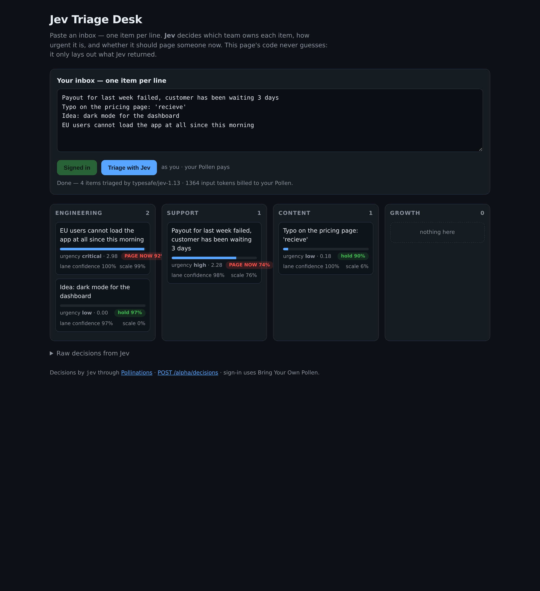
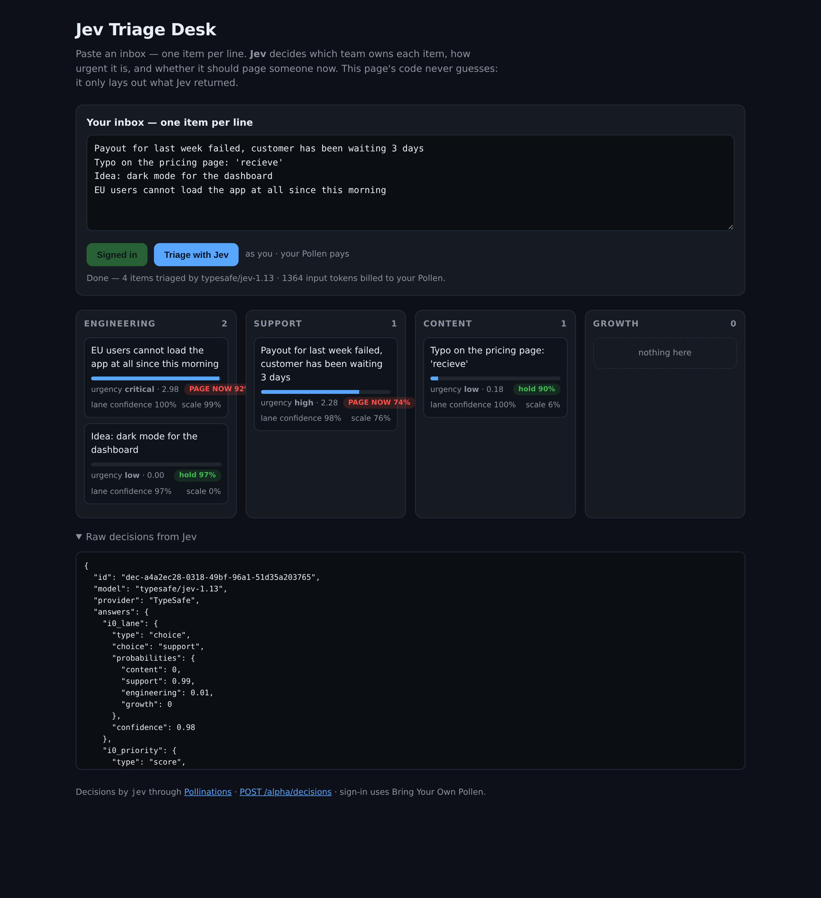

# Jev Triage Desk

Paste an inbox — one item per line. **[Jev](https://gen.pollinations.ai/docs)** decides, for every item, three things, and the page code does nothing except act on those answers:

| Decision | Question type | What the code does with it |
| --- | --- | --- |
| Owning team | `choice` — engineering / support / content / growth | moves the card into that team's column |
| Urgency | `score` — rungs `low → critical` | draws the urgency bar, sorts each column |
| Page now? | `noul` | adds a `PAGE NOW` badge above 50% |



## How the decisions are made

One request carries the whole inbox:

```js
POST https://gen.pollinations.ai/alpha/decisions
{
  "model": "jev",
  "state": { "inbox": ["Payout failed...", "Typo on the pricing page..."], "user_goal": "Triage the inbox." },
  "questions": {
    "i0_lane":     { "type": "choice", "instructions": "Inbox item #1: \"...\" Which team should own this item?", "criteria": { "engineering": "code, infra, deploys, bugs", ... } },
    "i0_priority": { "type": "score",  "instructions": "...", "criteria": ["low", "medium", "high", "critical"] },
    "i0_now":      { "type": "noul",   "instructions": "Should this page an on-call human right now?" }
  }
}
```

Every question quotes its own item, so Jev always knows which line it is judging. The response (`answers.i0_lane.choice`, `answers.i0_priority.score`, `answers.i0_now.noul`) is the only input to the render function — there is no heuristic in this repo that guesses a lane, ranks text, or invents a score.



The full raw response is also visible inside the app, one click away, under "Raw decisions from Jev".

## Bring Your Own Pollen

Sign-in is OAuth authorization-code + PKCE, entirely in the browser: no client secret, no backend, no shared key. You sign in, your own Pollen pays for your runs, and the app never holds a key of its own.

## Run locally

```bash
python3 -m http.server 8000     # then open http://localhost:8000
```

Decisions by Jev through [Pollinations](https://pollinations.ai).
